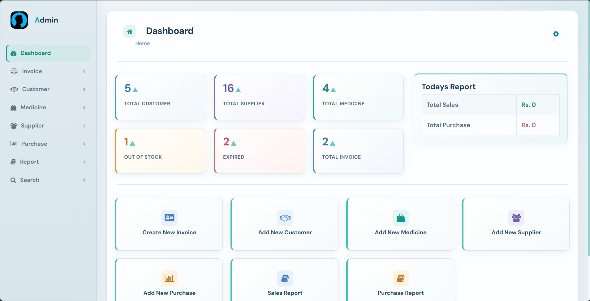
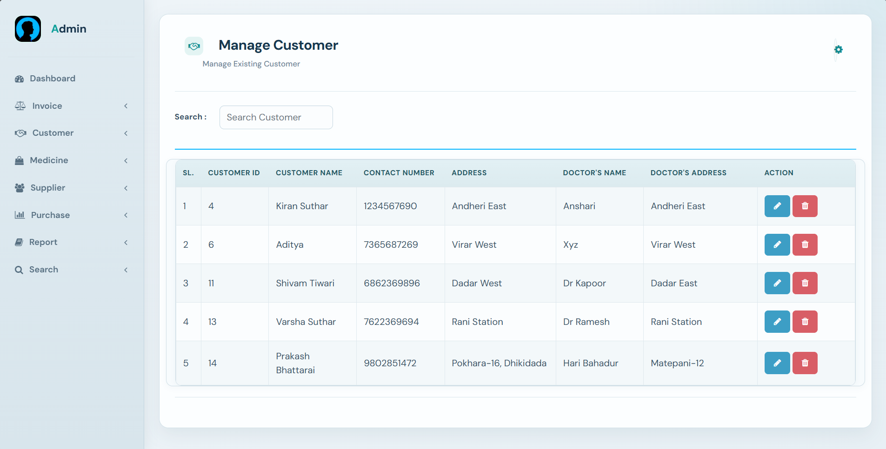
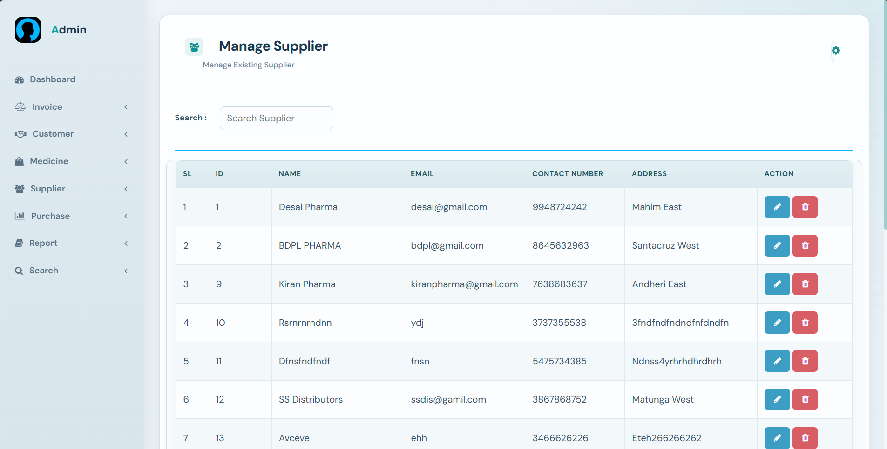
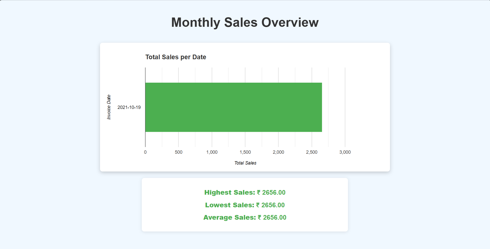
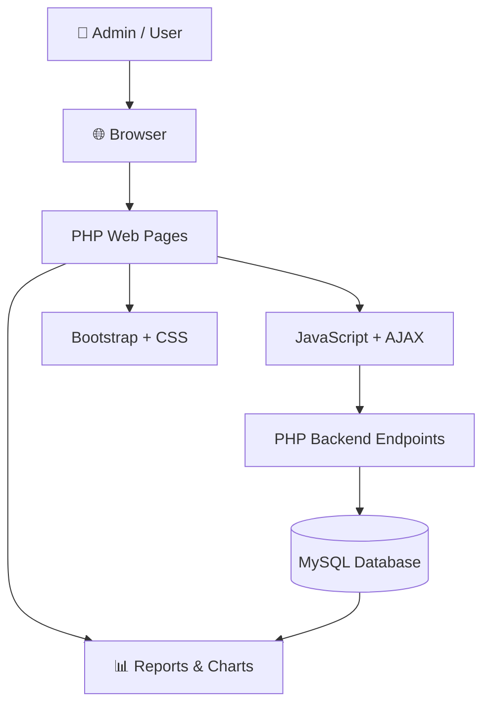
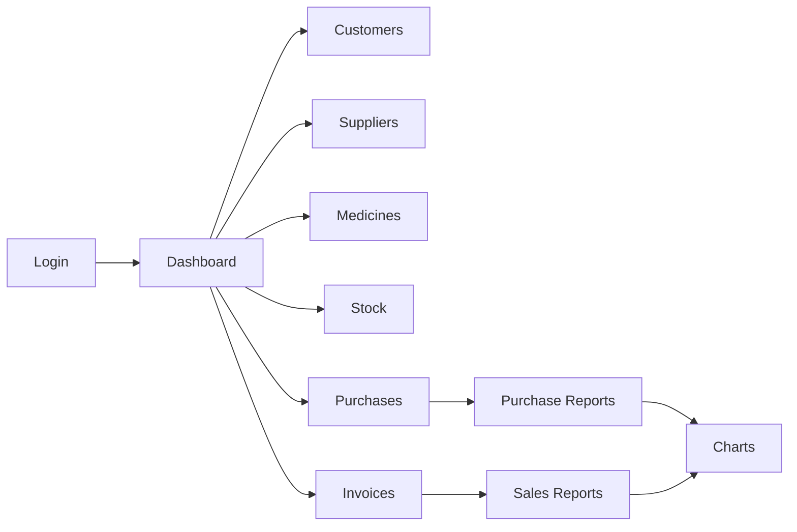
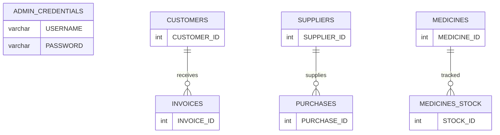
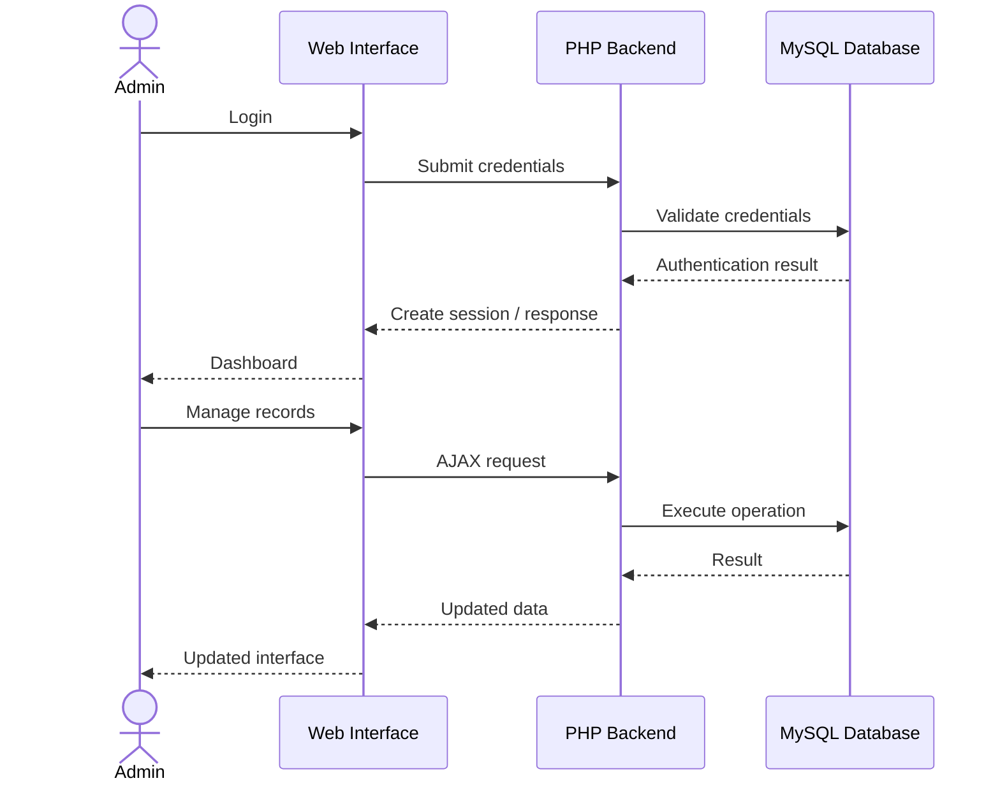

# 💊 Pharmacy Management System

<p align="center">
  <strong>A web-based pharmacy management platform for inventory, customers, suppliers, purchases, invoices, and sales reporting.</strong>
</p>

<p align="center">
  
  
  
  
  
</p>

<p align="center">
  <a href="https://github.com/Samruddhi-Shinde-2024/Pharmacy-Management-System">
    
  </a>
  
</p>

---

## 📌 Overview

**Pharmacy Management System** is a web-based application designed to simplify day-to-day pharmacy operations through a centralized management interface.

The system provides functionality for managing medicines, customers, suppliers, stock, purchases, invoices, and reports. It also includes dashboard statistics and data visualizations to make operational information easier to understand.

The project was developed using **PHP, MySQL, JavaScript, Bootstrap, HTML, and CSS**, with XAMPP used as the local development environment.

---

## ✨ Key Features

### 📊 Dashboard

* Centralized pharmacy overview
* Customer, supplier, medicine, stock, and invoice statistics
* Out-of-stock and expiry visibility
* Today's sales/purchase summary
* Quick access to frequently used operations

### 👥 Customer Management

* Add customers
* View and manage customer records
* Search customers
* Edit customer information
* Delete customer records

### 🏢 Supplier Management

* Add suppliers
* View and manage supplier records
* Search suppliers
* Edit supplier information
* Delete supplier records

### 💊 Medicine Management

* Add medicines
* Manage medicine information
* Search medicines
* Update medicine details
* Track medicine-related information

### 📦 Stock Management

* Monitor medicine stock
* Identify out-of-stock medicines
* Track expiry-related information
* Manage stock records

### 🛒 Purchase Management

* Record purchases
* Associate purchases with suppliers
* Add medicines and quantities
* Calculate purchase totals
* Search and manage purchase records

### 🧾 Invoice & Sales Management

* Create customer invoices
* Add medicines to invoices
* Calculate quantities and totals
* Apply available billing calculations
* Manage existing invoices
* Search invoice records

### 📈 Reports & Analytics

* Sales reports
* Purchase reports
* Date-based report filtering
* Sales/customer visualizations
* Supplier-related visualizations
* Invoice/sales charts
* Printable report functionality

### 🔐 Authentication

* Admin login
* Session-based authentication state
* Protected application pages
* Logout functionality

---

## 🖥️ Screenshots

A glimpse of the Pharmacy Management System interface, management modules, and analytics dashboard.

<table>
  <tr>
    <td width="50%">
      
    </td>
    <td width="50%">
      
    </td>
  </tr>
  <tr>
    <td width="50%">
      
    </td>
    <td width="50%">
      
    </td>
  </tr>
</table>

> The repository contains additional screenshots covering the application's management, billing, reporting, and dashboard interfaces.

---

## 🏗️ System Architecture



### Application Flow



---

## 🧩 Core Modules

| Module             | Purpose                                            |
| ------------------ | -------------------------------------------------- |
| **Dashboard**      | Overview of pharmacy operations and key statistics |
| **Customers**      | Manage customer records                            |
| **Suppliers**      | Manage supplier information                        |
| **Medicines**      | Maintain medicine records                          |
| **Medicine Stock** | Monitor inventory and stock status                 |
| **Purchases**      | Record and manage purchases                        |
| **Invoices**       | Generate and manage sales invoices                 |
| **Reports**        | Analyze sales and purchase information             |
| **Charts**         | Visualize operational data                         |
| **Authentication** | Manage admin login and sessions                    |

---

## 🛠️ Tech Stack

| Technology          | Usage                                    |
| ------------------- | ---------------------------------------- |
| **PHP**             | Server-side application logic            |
| **MySQL / MariaDB** | Relational database                      |
| **JavaScript**      | Client-side interaction and AJAX         |
| **HTML5**           | Application structure                    |
| **CSS3**            | Custom styling                           |
| **Bootstrap**       | Responsive UI components and layout      |
| **XAMPP**           | Local Apache + MySQL/MariaDB environment |

---

## 🗄️ Database

The project includes a complete database dump:

```text
pharmacy.sql
```

The primary database is:

```text
pharmacy
```

Major entities include:



> The exact columns and relationships are defined in `pharmacy.sql`.

---

## 🚀 Getting Started

### Prerequisites

Install:

* [XAMPP](https://www.apachefriends.org/)
* A modern web browser

### 1. Clone the repository

```bash
git clone https://github.com/Samruddhi-Shinde-2024/Pharmacy-Management-System.git
```

### 2. Move the project into XAMPP

Copy the project folder into:

```text
C:\xampp\htdocs\
```

The final path should be:

```text
C:\xampp\htdocs\Pharmacy-Management-System
```

### 3. Start XAMPP

Open XAMPP Control Panel and start:

```text
Apache
MySQL
```

### 4. Create the database

Open:

```text
http://localhost/phpmyadmin/
```

Create a database named:

```text
pharmacy
```

### 5. Import the database

Select the `pharmacy` database and import:

```text
pharmacy.sql
```

### 6. Open the application

Visit:

```text
http://localhost/Pharmacy-Management-System/
```

---

## 🔑 Demo Credentials

The included demonstration database contains the default admin credentials:

```text
Username: admin
Password: admin123
```

> For a real production deployment, credentials should never be kept as plaintext and default credentials should be changed.

---

## 📁 Project Structure

```text
Pharmacy-Management-System/
│
├── bootstrap/                 # Bootstrap CSS, JS and fonts
│
├── charts/                    # Chart pages and chart data endpoints
│   ├── DEMO/
│   ├── Invoices/
│   └── Sales/
│
├── css/                       # Application stylesheets
│
├── images/                    # Images and project screenshots
│   └── screen-shots/
│
├── js/                        # Client-side JavaScript
│
├── php/                       # Backend PHP endpoints
│   ├── db_connection.php
│   ├── report.php
│   ├── suggestions.php
│   └── ...
│
├── sections/                  # Shared HTML fragments
│
├── index.php                  # Application entry point
├── login.php                  # Login page
├── home.php                   # Dashboard
├── new_invoice.php            # Invoice creation
├── purchase_report.php        # Purchase reporting
├── sales_report.php           # Sales reporting
├── pharmacy.sql               # Database dump
└── .gitignore
```

---

## 🔄 Application Workflow



---

## 🧪 Validation & Testing

The final project was audited for its core demonstration workflows.

### Verified

* Login/session/logout flow
* Dashboard data
* Customer search endpoints
* Supplier search endpoints
* Medicine search endpoints
* Stock search endpoints
* Invoice search endpoints
* Purchase search endpoints
* Customer/supplier/medicine suggestions
* Sales report endpoints
* Purchase report endpoints
* Chart data endpoints
* Main application page loading
* PHP syntax
* JavaScript syntax
* CSS consistency
* Modal layering and interaction
* Purchase report column alignment

The final source and local XAMPP copies were synchronized before the GitHub repository was finalized.

---

## ⚠️ Known Limitations

The current imported database schema does not contain the additional pharmacy profile fields expected by the existing **My Profile** and **Forgot Password** screens.

Therefore, these optional flows are not recommended for the primary demonstration.

The core pharmacy workflow remains usable without them.

A local jQuery asset is also referenced by some pages but is not required by the project's core JavaScript flows.

---

## 🔮 Future Enhancements

Possible future improvements include:

* Secure password hashing and credential management
* Role-based access for multiple pharmacy staff members
* Complete administrator profile management
* Password reset through verified email
* Advanced inventory alerts
* Low-stock notifications
* Supplier payment tracking
* More detailed sales analytics
* Exportable PDF/CSV reports
* Production deployment with secure environment configuration

---

## 🎯 Project Highlights

* Centralized pharmacy management dashboard
* Inventory and stock monitoring
* Customer and supplier management
* Purchase and invoice workflows
* Sales and purchase reporting
* Data visualization
* AJAX-based interactions
* Responsive Bootstrap interface
* MySQL-backed data persistence
* Session-based authentication

---

## 👩‍💻 Author

### Samruddhi Shinde

Information Technology Student at **Vishwakarma Institute of Technology, Pune**

Interested in:

* Full Stack Development
* Machine Learning
* AI-powered applications
* Software Engineering

<p align="center">
  <a href="https://github.com/Samruddhi-Shinde-2024">GitHub</a>
  •
  <a href="https://www.linkedin.com/in/samruddhi-shinde-37a3862a8/">LinkedIn</a>
</p>

---

<p align="center">
  ⭐ If you found this project useful, consider giving the repository a star!
</p>
